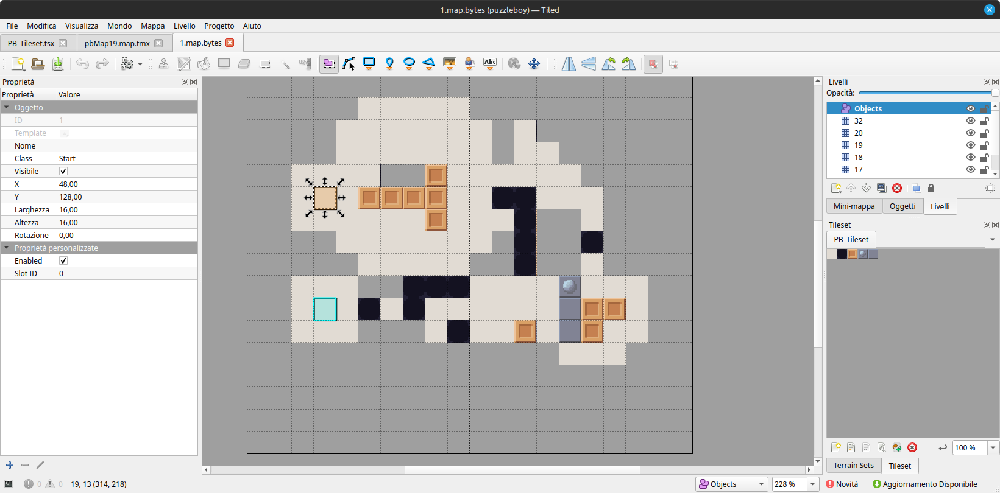

# puzzleboy-tiled

This is an extension for [Tiled](https://www.mapeditor.org/), a 2D map editor. It can import and export Puzzle Boy maps for SMT Nocturne HD Remaster. Tiled versions 1.10 and higher are supported. Older versions might work too.
The `project` folder is a Tiled project with a few object classes and the script included. *I recommend using this extension inside this folder.*
The extension itself comes with a basic 16x16 tileset I made. If you really want to make your own, copy it somewhere else. Tile size doesn't matter. Note that each tile contains a hexadecimal value in the `Class` property.
## How to make a map
To better understand how a map is structured, I recommend importing a map from the original game.
All Puzzle Boy maps are **20x20** big (effectively 18x18, the game doesn't draw walls on map borders). You need **1 object layer** and at least **1 tile layer**. You can name layers as you wish. I recommend naming tile layers as numbers for more control over their priority. 
### Tiles
Every tile layer is a group of tiles. Each group shares some behaviors.
When a file is exported as .map.bytes, all tile layers are merged. Their name is used to determine the group they represent. If the name is not a valid number (= smaller than 256), a new one is assigned depending on layer priority. Layers with higher numbers replace every tile that overlaps with their own. All empty tiles remaining are converted into walls (ID "20", not in tileset).

If 2 layers share the exact same name, they get merged together.
Every box and every swivel block needs its own layer to function. Well, unless you want to move two boxes at the same time.
### Mechanics and limitations
The shape of a box is not important. Boxes can only be moved if every box tile in the group finds an empty space. Similiarly, you can only fill holes when every box is on top of one.
Swivel blocks are mostly hardcoded. 1-arm swivel blocks have no length limits. If you want more than 1 arm, they need to be the same length, with a max length of 2. 
You can't move other tile types with boxes.
### Objects
With objects I specifically mean starts and goals. A map can contain 4 starts (object class `Start`) and 1 goal (`Goal`). 
To create an object, select the Rectangle tool, hold `Ctrl` to enable grid snapping and make a 1 tile square. Then assign a class depending on the type.
If your objects aren't aligned, the export process will do it for you.
You can enable start objects with the custom boolean property `Enabled`. If you have more than 1 start, assign a number from 0 to 3 to each object's `Slot ID`.
## Testing maps
To make testing less time consuming, you can replace the `pazzleboy` bundle while the game is running (outside the minigame).
If you use Puzzle Boy Maniax, I left some debug functions accessible via UnityExplorer. Use `ReplaceTable()` to reload the level table inside `PuzzleBoyManiax.cfg`.
## Notes
- I suggest saving your file as .tmx until you want to export it.
- Maps with too many boxes or swivels might not load properly in Nocturne HD. I haven't tested it properly, but I think vanilla map 19 softlocks because it has more than 16 boxes/box layers.
- You can give a color to each layer for easier editing.
## Known bugs and missing features
- Part of the file extension is omitted by default on export (".bytes" instead of ".map.bytes").
- The flag `Enabled` is not considered unless it's set explicitly.
- Tiled group layers are not supported.
